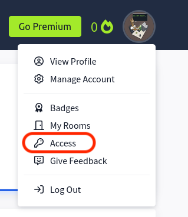

# Create an Account

[TryHackMe](https://tryhackme.com), or short THM, is a beginner friendly platform to learn cyber security.
We recommend this platform for beginners and use it in our newbie events and trainings. THM offers *Walktrough* and *Challenges (CTF)* rooms, more on that later. For now we need an account. Althoug THM offers a subscription service which provides access to additional rooms, the free version is sufficient for a long time and wide area of things to learn.

You can sign up for an account [here](https://tryhackme.com/signup) and need to provide a username, e-mail and password. You should use a password manager.
Then you will be asked some questions to personalize your learning experince, this affects which *Learning Paths* will be recommended to you.

THM offers different *Learning Paths*, consisting of different rooms. Each path is design to for you to learn and experiment in different topics or fields. You can do single rooms, but for a guided experience you should commit to a path fitting for your experience and interest.

The way you learn on THM is by doing rooms. *Walktrough* rooms are intended to provide you with basic knowledge and theoretical background information. *Challenge* or *CTF* rooms are intended to provide you a hand on labs experience. In these rooms you will need to know some basics and depending on the difficulty you will get more or less tips and guidance on how to hack the box.

Once you're signed up you can acces a wide range of *Learning Paths* and *Walktrough* or *Challenge* rooms.

To hack a box you usually need to compromise it and escalate your privileges. Meaning you need to abuse a misconfiguration or vulnerability to get access and then escalate this access to root/admin privileges.
And to compromise it in the first place you will need some tools, this is where Kali comes into play. Once you have your Kali running and are connected via a vpn you can start hacking!

See our guide on installing a hypervisor: [Guide: Install Hypervisor](.HypervisorInstall.md)

See our guide on installing Kali: [Guide: Install Kali](./InstallKali.md)

#  TryHackMe VPN

Boxes provided by THM are intentionally vulnerable but they are only accessable through their Virtual Private Network *VPN* and do not have an internet connection.

Once you are logged in on THM you can find a room explainung how to connect yourself to the THM VPN [here](https://tryhackme.com/r/room/openvpn).

We want to connect from within our Kali VM so we only need to do the follwing Tasks:
1. Get the configuration file
4. Connect using `openvpn`
6. Check our connection

## Get Config File

In *Task 1* you find instructions to download your VPN config file from the [access](https://tryhackme.com/access) area of your profile.

Sometimes, especially on the first download, this config can be bugged.
You can change your region and regenerate the configuration file if that is the case.

## Connect to THM VPN

In *Task 4* you find instructions to connect to the THM VPN.

You can connect to the VPN via `sudo openvpn <Your_Config.ovpn`. This process needs to keep running, if you close it you will lose your VPN connection.

If you did not adjust the download path when downloading the vpn config file, the location of your vpn config file will be `"/home/`<User>`/Dowloads/<THM_User>.ovpn"`

An OpenVPN client should already be installed on Kali, if this is not the case you can install it via `sudo apt update && sudo apt install openvpn`

## Check VPN Connecetion

Finally you can check your VPN connection as shown in *Task 6*.

You will always be able to reach `10.10.10.10` when connected to the THM VPN.
If a box in a room is not responsive you can check your VPN connection via ping or browse to said IP.
